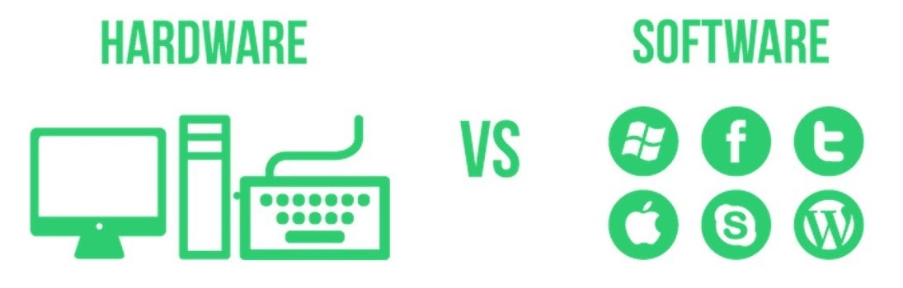
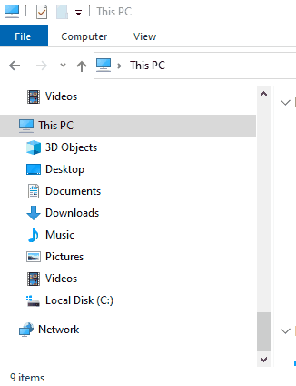
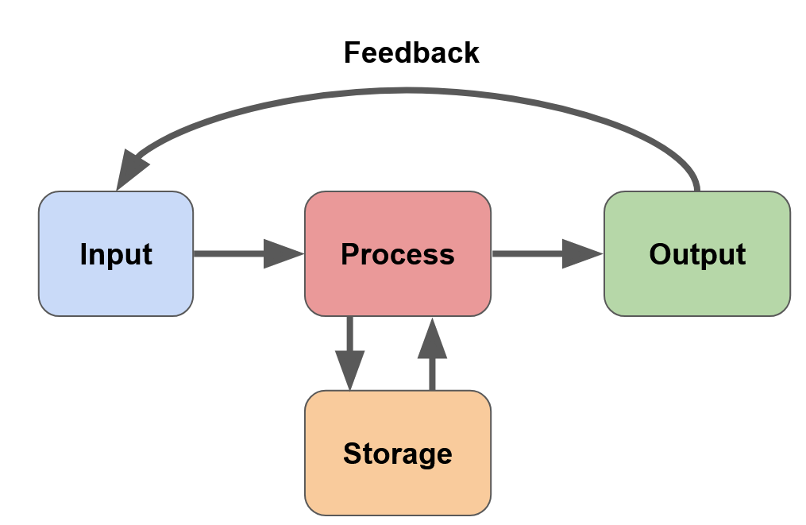
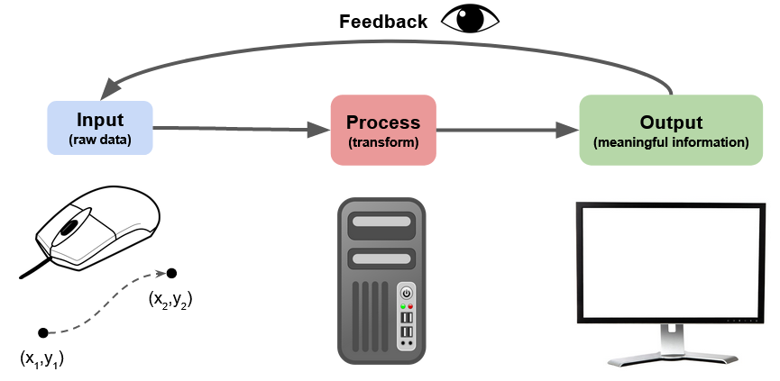
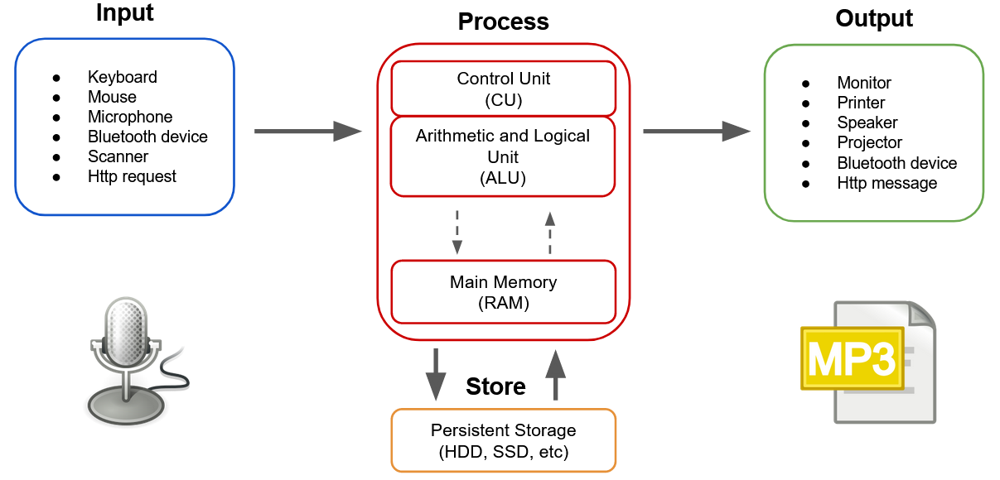

# Basic Terminology & Information Cycle

## **What is a computer?**

It's important to expend our understand of what a computer is.

Let's use the definition from GCF Global for [What is a Computer](https://edu.gcfglobal.org/en/computerbasics/what-is-a-computer/1/):

> A **computer** is an electronic device that manipulates information, or data.
>
> It has the ability to **store**, **retrieve**, and **process** data.

Based on this definition, can you give me examples of computers **other than** the laptop and desktop computer? *Try a Word Cloud !*

### **Hardware vs. software**

<a href="https://www.youtube.com/watch?v=NARrnGza4kA"><em>Professor Adam Morgan Hardware vs Software</em></a>

> **Hardware** refers to the **physical structure** of the computer. 
>
> *Basically the stuff you can touch.*

Some examples are the hard drive, central processing unit, wireless card, USB ports, etc. It can also refer to the peripherals such as the mouse and keyboard.

> **Software** is any **set of instructions** that tells the hardware **what to do** and **how to do it**.
>
> The stuff you cannot touch.

This includes things like the operating system. applications and firmware.

 

## Basic Computer Parts

We'll be making lots of references to computer parts so let's briefly go over the most important ones:

>  📖 For this part of the notes, refer to:
>
>   GCF Global lesson on [Inside a Computer](https://edu.gcfglobal.org/en/computerbasics/inside-a-computer/1/)

Together the parts above form a system. Try to look at them as the **resources available** for your computer system to get things done.

Different tasks will need different levels of resources so they might be less available for other computations.

## Finding Computer Specs (in Windows)

To find out how many resources we have, let's look at the specifications for our computers.

There are many ways to find this information. Some of the simplest ones are:

### Processor & RAM

1. Open the File Explorer

   - ( by typing "File Explorer" in the Windows Start Menu ) 

2. Right click on the "This PC" icon

3. Select "Properties"

4. Note the processor type and amount of RAM

   

### Storage Space

For the amount of long-term storage space (assuming you only have one storage disk):

1. Open the File Explorer
2. Right click on the "Local Disk (C:)" icon
3. Select "Properties"
4. Note the capacity of your disk

### Resource Load & Availability

To see how much of your resources are being used at any given time:

Option 1:

1. Open the the Window's start menu  ( *press the Window key* )
2. Search for "Task Manager" and launch it.

Option 2:

1. Press the following keys of your keyboard at the same time:
   - Ctrl + Alt + Delete
2. Choose the "Task Manager" option

Once Task Manager is open, cycle through the different tabs to inspect the resource load on each component of your system.

## The Information Cycle

The information cycle is how the computer transforms raw data into useful information.

**This is all a computer can do !**

As programmers we can only create a pre-defined process that will:

- take an input; and
- generate an output

Data might be stored or retrieved during this process.

Additionally, the output of one process might be the input of another process or might be used to adjust the input.

### Example: moving the mouse on the screen

1. The mouse provides raw displacement data to the computer (changes in x and y).

2. Based on the mouse's displacement, the computer is calculating the position of the pointer.

3. The pointer is then drawn on the monitor so it can be observed.

4. After observing the new position of the mouse, humans can decide it's next move.

## Closer Look at the CPU

The Central Processing Unit (CPU) of a computer is responsible for transforming most of the raw data in the information cycle. This can take many forms such as:

- Comparing and combining
- Calculating
- Coordinating
- Loading and executing instructions
- many other things

> The CPU is made of multiple "modules", we will simplify it to the following modules:
>
> **CU (Control Unit)**: Controlling the fetching and execution of instructions
>
> **ALU (Arithmetic Logic Unit):** Executing, comparing and calculating

Adding this new model to the information cycle we get the following picture:

