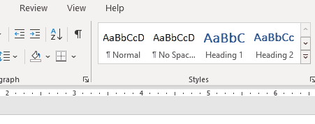

# Collaborating: Comments & Changes

An important aspect of collaborating effectively is providing comments and change suggestions to someone's document.

In this section we will look at how to add comments to a Word document as well as how to suggest non-permanent edits and how to invite others to co-edit.

## References & Guides

> 📖 For this section of the notes please refer to the following resources from Microsoft:
>
> -  [Insert or delete a comment](https://support.microsoft.com/en-us/office/insert-or-delete-a-comment-8d3f868a-867e-4df2-8c68-bf96671641e2)
> -  [Track changes in Word](https://support.microsoft.com/en-us/office/track-changes-in-word-197ba630-0f5f-4a8e-9a77-3712475e806a)
> -  [Accept tracked changes](https://support.microsoft.com/en-us/office/accept-tracked-changes-4838d24c-d5d1-4c6c-8e39-78b44bd2b4cc)
> -  [Share a document](https://support.microsoft.com/en-us/office/share-a-document-d39f3cd8-0aa0-412f-9a35-1abba926d354)
> -  [Collaborate on Word documents with real-time co-authoring](https://support.microsoft.com/en-us/office/collaborate-on-word-documents-with-real-time-co-authoring-7dd3040c-3f30-4fdd-bab0-8586492a1f1d)

## Choose the Markup View

It's possible to select what kind of suggestion markup will be shown.

For example, you may choose to show:

- **Original:** Only the original text without any suggestions or comments;

- **No Markup:** To show what the text will look like if all suggested changed were incorporated.

  

> For more details, see the reference [Track changes in Word](https://support.microsoft.com/en-us/office/track-changes-in-word-197ba630-0f5f-4a8e-9a77-3712475e806a)

## Exercises

### Exercise 1

Download the file *Screenshots.docx* available in Moodle under Week 11.

Complete the following tasks:

**Commenting & Accepting Changes**

1. Change the markup view  so that:
   1. It shows what the original document looked like. Once done move to the next sub-step;
   2. It shows what the document will look like if all suggestions are accepted. Once done move to the next sub-step;
   3. Finally change it to show all markup and leave it like that.
2. Reply to the first comment with your opinion.
3. Resolve the second comment.
4. Accept the changes suggested in under *Steps* for *Windows' Snipping Tool*.

**Tracking & Sharing**

1. Start tracking changes and finish the *Steps* for *Creating Gifs with ScreenToGif*.
2. Share this file with **two colleagues** from the class so that they can edit the file.
   1. To share it online you will need to upload the file to OneDrive, connect it to your JAC student account.

**Suggesting**

1. Once you receive a file from your colleagues, do the following:
   1. Accept at least one of their changes;
   2. Reject at least one of their changes.
   3. Make a comment on at least one of their changes.
2. Make sure you are tracking your changes and make **two new changes** to your colleague's file.

**Final review**

1. Once your colleagues are done making suggestions to your file, choose to accept of reject them.