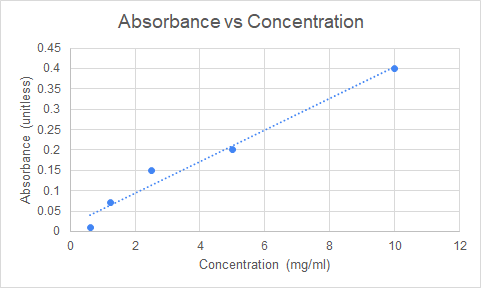

# Charts in Excel

 

> 📖 For this section of the notes please refer to the following resources
>
> - [Charts](https://edu.gcfglobal.org/en/excel/charts/1/)  from GCF Global
> - [Create a chart from start to finish](https://support.microsoft.com/en-us/office/create-a-chart-from-start-to-finish-0baf399e-dd61-4e18-8a73-b3fd5d5680c2) from Microsoft Support
> - [Add a trend or moving average line to a chart](https://support.microsoft.com/en-us/office/add-a-trend-or-moving-average-line-to-a-chart-fa59f86c-5852-4b68-a6d4-901a745842ad) from Microsoft Support

 

## Trendlines

Trendlines can be added to an graph to easily visualize a trend in the date.

There are different types of trendlines that can be used. The most common is a linear trendline.

 

 

## Diving Deeper (optional)

### Equation of a line

In the previous section we learned to add trendlines to a data set.

Once a trendline has been added, it is possible to extract the equation of that line and use those values to perform additional analysis on the data set.

 

The equation of a line is typically described as:

 

 

> If the **slope** and the **y-intercept** are known, then for any given X value we can find the respective Y value **and vice-versa**.

 

There are two ways of extracting the equations of a line from plotted data in Excel:

- Display the equation on the graph and manually write down the Slope and Y-intercept constants.
- Use the build-in `SLOPE` and `INTERCEPT` functions (prefered method)

 

See the links below to learn how to extract the equation of a line from Excel:

> 📖 For this section of the notes please refer to the following resources
>
> - [Excel trendline types, equations and formulas](https://www.ablebits.com/office-addins-blog/2019/01/16/excel-trendline-types-equations-formulas/) from Ablebits.com

 

## Exercises

Download the Excel file *wk12-charts-exercises.xlsx* available in Moodle under Week 12.

> Allways make sure your axis, title and legends are labeled properly.

### Exercise 1

Refer to the sheet *Staffing*

1. Insert a chart that will **visually contrast the staffing levels** of the current year and the two-year projection.
2. For the two-year projeciton, insert a pie graph that will show the each city department as a percent of total staffing.

### Exercise 2

Refer to the sheet *Enrollment*

1. Add a chart that will show any trends in enrollment data over time.
2. Set the minimum value of the Y-axis to 400 and it's maximum value to 900.
3. (challenge) For the McKinley school, insert a trendline and forecast it (extrapolate) it forward by two years (periods).