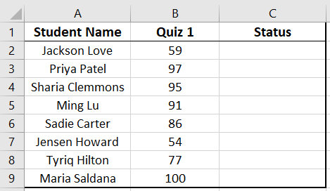
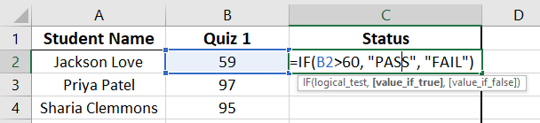
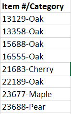
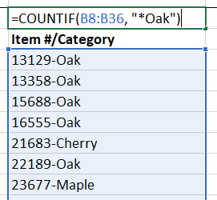

# Excel Functions

<br>

> 📖 For this section of the notes please refer to the following resources:
>
> - [Functions](https://edu.gcfglobal.org/en/excel/functions/1/) by GCF Global
> - [IF Function](https://support.microsoft.com/en-us/office/if-function-69aed7c9-4e8a-4755-a9bc-aa8bbff73be2) by Microsoft
> - [COUNTIF](https://support.microsoft.com/en-us/office/countif-function-e0de10c6-f885-4e71-abb4-1f464816df34) by Microsoft
> - [SUMIF](https://support.microsoft.com/en-us/office/sumif-c44b60c3-c9f4-4789-80fe-28a07f9b75b1?ui=en-US&rs=en-US&ad=US) by Microsoft

<br>

## **Basic Functions**

Please become familiar with the following basic Excel build-in functions:

- Sum
- Average
- Count
- CountA
- Days
- Max
- Min

## IF Function

For example, for a list of student's grades, you might want to output the word "PASS" or "FAIL", depending on the grade for a class.

<br>



<br>

To do this, we can use the **=IF function** in excel

> The **IF function** checks whether a condition is met. It returns one value if the condition is met (TRUE) and another value if the condition is not met (FALSE).

<br>

The specific syntax (order or the parameters and conditions) is as follow:

<br>

```
=IF( condition, value if true, value if false )
```

<br>

**Condition**: the criteria that we are checking. It must result in true or false.

**Value if true:** the new value of the cell if the **condition** is true.

- If this value is a text, it must be wrapped in double quotes ""

**Value if false:** the new value of the cell if the **condition** is false.

- If this value is a text, it must be wrapped in double quotes ""

<br>

In the school grades example above, if the pass or fail grade was 60, we would use the following command in the first cell of the "Status" column:



<br>

The condition is that the value inside cell B2 is greater than 60.

<br>

## Comparison Operators

There are a few comparison operators:

| Operator | Description   |
| -------- | ------------- |
| <        | less than     |
| >        | more than     |
| =        | equals to     |
| <>       | not equals to |

<br>

### Possible things to compare

When using the operators above, it's possible to compare:

- Text

  - Must wrap text with double quotes (eg. *“Sold”*)

- Numbers

- Dates

  - Must refer to a cell containing the date. You cannot add the data in the `=IF( )` formula.

    

<br>

## COUNTIF & SUMIF formulas

The **COUNTIF** and **SUMIF formulas** are similar to **IF**. They will count and sum if a specific condition is met.

<br>

```
=COUNTIF( range, condition )
```

<br>

```
=SUMIF( range, condition, sum range )
```

<br>

In **SUMIF** you must specify a **range to be summed** that is different from the range to be compared against the condition.

<br>

> For `COUNTIF` and `SUMIF` **you must wrap the operator and the value  with double quotes**


Using a date in the condition:

```
=COUNTIF(A1:A34, "<11/01/2020")
```

<br>

### Wild Card

Sometimes our condition is that a cell contains a keyword.

For example, consider the following data from a store's inventory:

<br>



<br>

If we wanted to count how many items match the keyword "Oak", the normal `COUNTIF` condition would not work. The text value of the cell changes every time.

> The * symbol (asterisk) can be used as a wild card to assume any value.
>
> It works as a "joker" or "fill in the blank"

To match any cell containing the text "Oak" we can perform the following `COUNTIF`:



## Exercises

Download the Excel file *wk12-Functions.xlsx* available in Moodle under Week 12.

### Exercise 1

Using sheet *Grades*, calculate the final grade that the student will receive.

### Exercise 2

Using sheet *t-shirts*, generate a small summary table with the number of t-shirts according to size.

### Exercise 3

Using sheet *Trees_Invertory*, calculate the missing values inside the summary tables. You can add auxiliary columns if necessary.