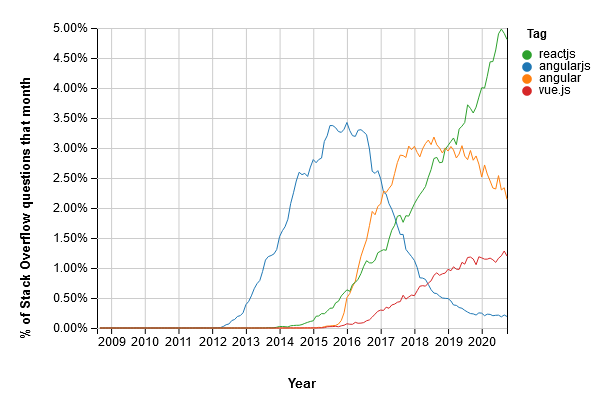
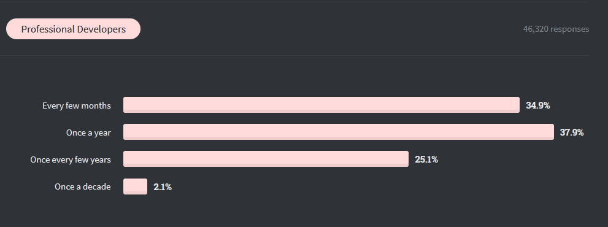
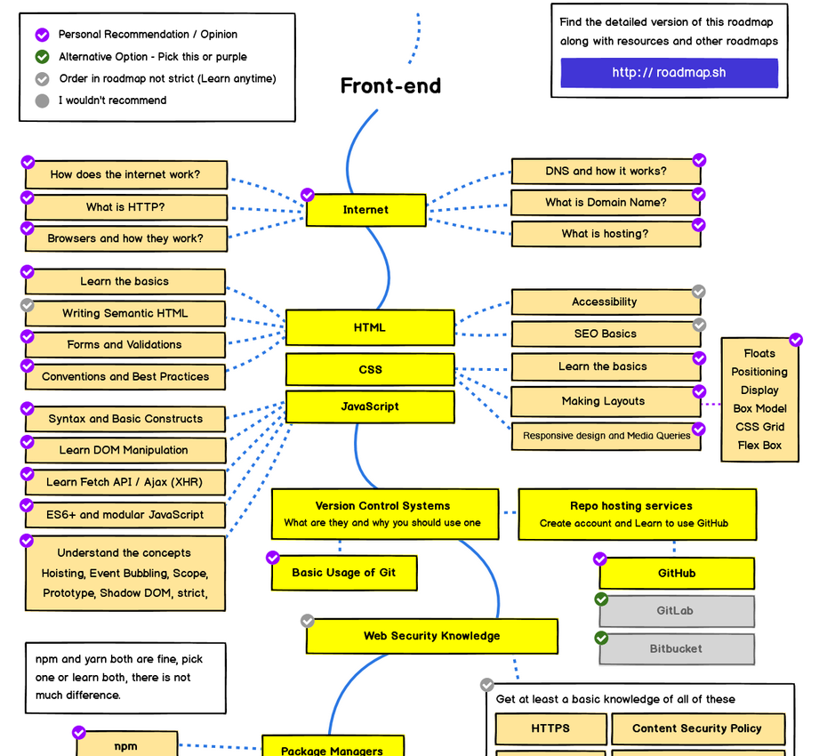

# Starting & Trends

Understanding where to start and on what technologies to focus on can be very overwhelming for beginners.

> It is very important to be able to take a step back and put technologies and trends in context.

This section explores some commonalities and trends in the different programming related roles.

## A beginner's Roadmap

Jessica from coder-coder.com has writen a great accessible roadmap for beginners on web development.

> For this section of the notes please refer to:
>
> [Learn web development as an absolute beginner (2020)](https://coder-coder.com/learn-web-development/)

<iframe width="560" height="315" src="https://www.youtube.com/embed/ysEN5RaKOlA" frameborder="0" allow="accelerometer; autoplay; clipboard-write; encrypted-media; gyroscope; picture-in-picture" allowfullscreen></iframe>

## Beyond Trends

Like any other industry the IT field is full of trends. By definition, trends will come and go.

It is important to be able to see beyond trends, and focus on fundamentals. Those will be forever relevant.

 

<a href="https://insights.stackoverflow.com/trends?utm_source=so-owned&utm_medium=blog&utm_campaign=trends&utm_content=blog-link&tags=angularjs%2Cangular%2Creactjs%2Cvue.js"><em>Trends in JavaScript Frameworks according to StackOverflow</em></a>

 

In the graph above, Stackoverflow shows trends in questions according to JavaScript frameworks. As you can see, 2016 was all about AngularJs, which is currently at the bottom.

> If you master programming fundamentals, you can easily move between languages and framewords.

**Learning to learn, is far more important than the language or framework that you are learning.**

 

Stackoverflow asked professional developers were **how often they have to learn a new technology**:

 

<a href="https://insights.stackoverflow.com/survey/2020#technology-learning-new-tech-frequency-professional-developers"><em>How often professional developpers need to learn new technologies.</em></a>

 

 

### Keeping an eye on trends 👀

Every year, the website Stackoverflow publishes the results of a survey that is taken by over 65,000 developers all over the world.

It is a great place to identify and be aware of trends:

[Stack Overflow Annual Developer Survey](https://insights.stackoverflow.com/survey)

## Diving Deeper 🤿 (optional)

To learn more about how different web technologies are connected, take a look at the following resource:

- [The 2020 Web Developer Roadmap – A Visual Guide to Becoming a Front End, Back End, or DevOps Developer](https://www.freecodecamp.org/news/2019-web-developer-roadmap/)

 

This guide connects specific concepts and technologies in a typical developer's learning path.

It also makes recommendations of things to focus on and things to avoid.

**There is a lot of detail so be careful because it's easy to feel overwhelmed.**

 

