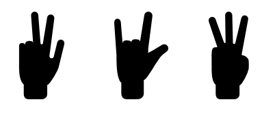
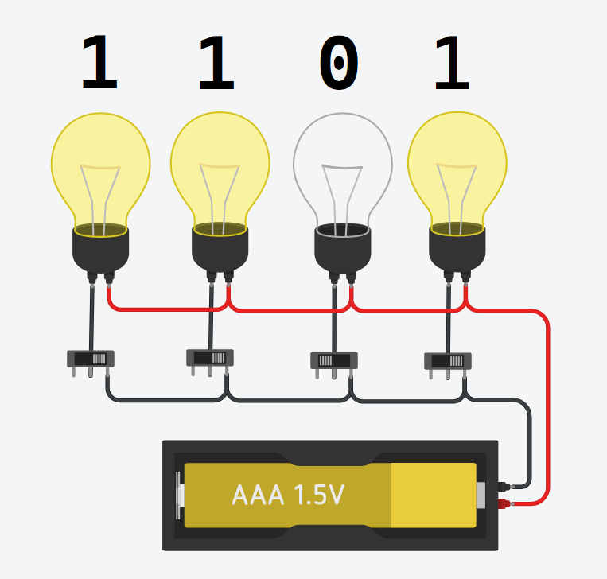
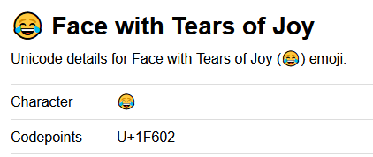
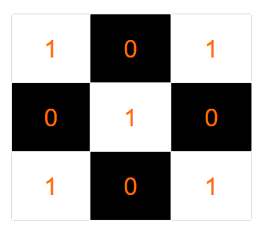
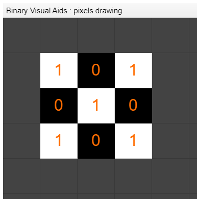
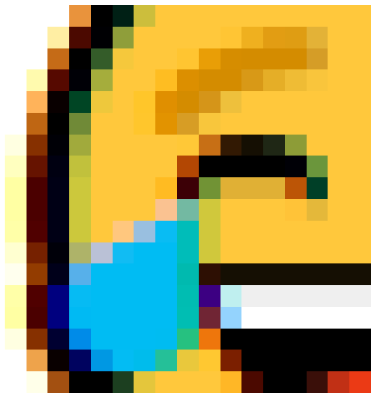
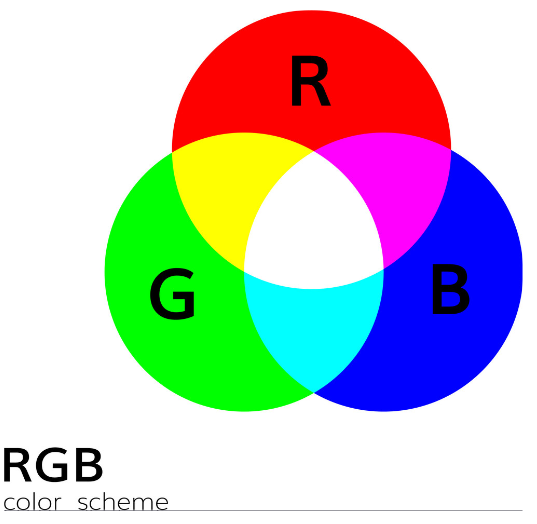

# Binary Data

Modern computers use billions of tiny transistors to process information.

We saw that a transistor is fundamentally a switch with **two possible states: ON or OFF**.

 

## Binary System

The state of a switch is a **tiny piece of information** that can be used to:

- **Count** - *ex. How many switches are on at a given moment ?*
- **Compare** - *ex. Do these two switches (or group of switches) have the same state ?*
- **Add** **or Subtract** - *ex. Turn three additional switches ON.*
- **A combination of the above** - *ex. If four or more switches are ON (count and compare), turn two of them OFF (subtraction).*

 

> Since these operations revolve around only two possible states (or values), we call this a **binary system**

 

Comparing the state of two or more switches is relatively simple, they are either the same or they are not.  

Adding or subtracting requires the ability to count so let's first focus on how we can count using a binary system.

 

## Binary Counting

Counting with our fingers is done using a sort of binary system. Each finger can only take one of two values: UP or DOWN.

When counting to three, we "put" any three fingers in the UP position:

 

<a href="https://www.flaticon.com/free-icon/three-fingers-count-of-hand-silhouette_57615?term=three%20fingers&page=1&position=49"><em>Three ways of counting to three with fingers</em></a>

 

In the image above, all three hands show the same value (the number 3). In this system, five fingers can represent a maximum of five distinct numbers (1 to 5, not counting 0).

If we wanted to count to six, we would need a whole new finger (or switch), which is a fairly inefficient system.

It would be much more efficient to a assign a specific value to each position in the hand.

To understand how this is done let's look at the decimal system. 

 

### The Decimal System

In the decimal system each digit (or counter) can take ten distinct values ( 0, 1, 2, 3, ... , 8, 9). 

Unlike the hand-counting system, **the position of each digit is important since it gives us additional information.**

For example, the numbers 123, 312, and 231 are different numbers but they use the same digits.

 

The following conversion happens automatically in our heads:

Number: 		3			1			2

​				=	3 **x100** + 1 **x10** + 2 **x1**

 

**Moving from right to the left:**

- the first digit is multiplied by 1

- the second digit is multiplied by 10

- the third digit is multiplied by 100

 

> In this counting system each digit can take 10 possible values (zero to nine).
>
> This is called a system with base of 10

 

Each additional place holder (to the left) goes up by a factor of x10, which is equal to the base of the system.

 

Number:		 	6					3					1				2

​				=	6 **x1000**	+	3 **x100**	+	1 **x10**	+	2 **x1**

​				=	6 **x10³**	   +	3 **x10²**	 +	1 **x10¹**   +	2 **x10⁰**

 

### Binary & Conversion to Decimal

**In a binary system each digit can only take two possible values, zero or one.**

Therefore we have a system with a base of 2.

Similarly to the decimal system, the position of each digit carries information about a multiplier:

 

Binary:				1			  0			1

​					=	1 **x4**   +	0 **x2**   +	1 **x1**

​					=	1 **x2²**  +	0 **x2¹** +	1 **x2⁰**

 

Each additional place holder (to the left) goes up by a factor of x2, which is the base of this system.

 

Binary:				1				1			  0			1

​					=	1 **x8**	+	  1**x4**    +	0 **x2**   +	1 **x1**

​					=	1 **x2³**	+	1 **x2²**  +	0 **x2¹** +	1 **x2⁰**

 

> To convert from binary to decimal, simply multiply each binary digit by it's respective base multiplier

 

Binary:				1				1			  0			1

​					=	1 **x8**	+	  1**x4**    +	0 **x2**   +	1 **x1**

​					 =		8	 +		4	   +	  0	  +	 1

Decimal equivalent: 							13

 

The first 8 digits of a binary number represent the following multipliers in decimal:

 

| 128  |  64  |  32  |  16  |  8   |  4   |  2   |  1   |
| :--: | :--: | :--: | :--: | :--: | :--: | :--: | :--: |
|  2⁷  |  2⁶  |  2⁵  |  2⁴  |  2³  |  2²  |  2¹  |  2⁰  |

 

## Bits & Bytes

**The ON and OFF state of a transistor can be used to represent the 1 and 0 values of binary numbers.**

> Each binary digit is represented by a single transistor. 
>
> This single unit of data is called a bit.

 

Let's compare the transistor to an ON/OFF switch connected to a light bulb.

- If the switch is ON, the light bulb is lit and this represents the binary value of 1. 

- If the switch is OFF, there is no light, which represents the binary value 0.

 

<a href="#"><em>The small switches represent transistors controlling the current going to the light bulbs.</em></a>

 

In the image above we have **4 binary digits, the equivalent of four bits.**

As seen in the previous section, 1101 in binary represents the number 13 in decimal.

 

Typically **8 bits are grouped together to form 1 byte.**

Consider the byte 1 0 0 1 1 1 0 1.

In order to convert it to decimal we can use the same binary base table used above:

| Binary number   |   1   |  0   |  0   |  1   |  1   |  1   |  0   |  1   |
| --------------- | :---: | :--: | :--: | :--: | :--: | :--: | :--: | :--: |
| Base in binary  |  2⁷   |  2⁶  |  2⁵  |  2⁴  |  2³  |  2²  |  2¹  |  2⁰  |
| Base in decimal |  128  |  64  |  32  |  16  |  8   |  4   |  2   |  1   |
| Addition        | 128 + |  0   |  0   | 16 + | 8 +  | 4 +  |  0   |  1   |

**The result in decimal is 157**

 

> What is the largest decimal value that can be represented by a byte?

 

## Binary Beyond Numbers

Now we know that transistors are used to store bits of information (0's and 1's), however, how can we represent words, images, videos, and program instructions with numbers alone?

The way how text is represented in binary follows the same idea for how images and program instructions are stored in binary.

 

> In order to convert from binary numbers to any other form of data, we need to have a mapping system defined in our computer.
>
> In other words, **the computer needs to have access to some sort of dictionary.**

 

### Representing Words

Two computers exchanging binary data that represent letters need to have previously agreed on how they will translate from 0's and 1's to letters.

One early example of this translation system is the American 7-bit [ASCII character encoding](https://en.wikipedia.org/wiki/ASCII).

>  The term encoding means "A conversion of plain text into a code or [cypher](https://www.wordnik.com/words/cypher) form (for [decoding](https://www.wordnik.com/words/decoding) by the recipient)."

 

<a href="https://www.rapidtables.com/code/text/ascii-table.html"><em>ASCII Character Table</em></a>

 

When you text ***Hi!*** to a friend, your smartphone will perform the following conversions:

1. Translate each character into their ASCII numeric representation.

   1. H (upper case) = number 72

   2. i (lower case) = number 105

   3. ! (punctuation) = number 33

       

2. Convert each decimal number to binary

   1. Decimal 72 = 01001000
   2. Decimal 105 = 01101001
   3. Decimal 33 = 00100001

    

3. Transmit the binary data.

 

#### Special Characters

Similarly to the ! *(exclamation mark)*, there are other special characters we need to be represented.

For example:

- **Line break / carriage return** - used to mark the end of a line.
- **Space** - used to represent an empty space

 

### ASCII Limitations & Unicode

As mentioned before, the original ASCII system uses 7 bits to encore characters to letters.

**How many unique characters can be represented using 7 bits?**

2⁷ = ?

 

The ASCII code is naturally American-centered. Once computers around the world started to exchange information the 127 characters were not enough to include characters from other languages. Other nations had also developed their own encoding systems.

 

> A new international character encoding system was developed named **[Unicode](https://en.wikipedia.org/wiki/Unicode#Mapping_and_encodings), which is the default encoding standard today.**

<by>

Unicode can use 8 to 32 bits to encode characters, making it possible to represent 2³² = 4,294,967,296 different characters.

Depending on how many bytes of encoding will be used, a computer might use the Unicode standards UTF-8, UTF-16 or UTF-32.

This is enough bits to communicate all know human languages to date.

 

In addition to languages, Unicode has enough space to represent **emojis**:

😂 - Unicode value of 128,514 (decimal), or 1 1111 0110 0000 0010 (binary).

 

Unicode characters are typically listed as [Hexadecimal values](https://en.wikipedia.org/wiki/Hexadecimal) and are preceded by U+

 

<a href="https://emojipedia.org/emoji/%F0%9F%98%82/"><em>Emoji with respective Unicode in hexadecimal value.</em></a>

 

## Representing Images

Images are also stored and represented with binary data.

**The smallest unit of color in a screen is a pixel.**

> In order to draw on a screen the computer needs the instructions for how to "paint" each individual pixel.

 

Similarly to the binary to characters representation, the computer needs to know how to map (translate) a bit (or series of bits) to pixels.

 

<a href="https://en.wikipedia.org/wiki/Retina_display"><em>Visible pixels of the iPhone 3</em></a>

 

To illustrate this, let's consider a black and white screen for simplicity. In this screen, each pixel can only be black if it's off (not emitting light) or white if it's on (emitting light). 

**The ON / OFF state of the pixel is easily represented by the 1's and 0's state of a bit.**

 

If we had a screen that was 3x3 pixels, we could paint a simple check-board patterns using the following binary sequence: **101010101**

Note that every time we reach the end of the 3x3 display, the next bit is added to the next row of pixels.

 

<a href="#"><em>3x3 black & white display. Bits are shown for convenience.</em></a>

 

With a 8x8 display we can start to draw recognizable images. Try to draw the 64 bit sequence below:

0 0 0 0 0 0 0 0   0 1 1 0 0 1 1 0   0 1 1 0 0 1 1 0   0 0 0 1 1 0 0 0

0 0 1 1 1 1 0 0   0 0 1 1 1 1 0 0   0 0 1 0 0 1 0 0   0 0 0 0 0 0 0 0 

 

You can use the spreadsheet below. Simply add a 1 to get a white pixel or add a 0 to get a black pixel (download or make a copy of the file).

 

 

### Images with Color

Color images work  in a similar way as black & white images, however, because each pixel can take-on a range of different colors, we need to provide more information than a single bit per pixel.

 

<a href="#"><em>Individual pixels of a color image</em></a>

 

We can form any color by combining three fundamental colors:

- **R**ed
- **G**reen
- **B**lue

 

 

> Using the principle of RGB color addition, for each individual pixel on the screen we define the intensity of the Red, Blue and Green color.
>
> The intensity of each RGB color is provided in a range from 0 to 255.

 

<iframe src="https://web.stanford.edu/class/cs101/image-rgb-explorer.html" style="border:0px #ffffff none;" name="myiFrame" scrolling="no" frameborder="1" marginheight="0px" marginwidth="0px" height="460px" width="100%" allowfullscreen></iframe>

 

The following color is made by combining Red: 203, Green: 153, Blue: 126.

 

As seen before, the number 255 can be represented with a 8 bit number.

**So if we convert the RGB numbers to binary, each color will have a byte (8 bits) representation.**

The color above would be represented as (1100 1011, 1001 1001, 0111 1110  ), which are the bytes for the intensity of Red, Green and Blue respectively.

 

> Therefore, each pixel on the screen needs 3 bytes of information to be represented.
>
> An image that is 500x300 pixels has a total of 15,000 pixels and needs approximately 45,000 bytes of information to be represented.

 

When zooming into a color display you can see that each individual pixel is actually made of 3 tiny Red, Green, and Blue lights.

<a href="https://prometheus.med.utah.edu/~bwjones/2012/04/retina-display-revisited-for-the-ipad/"><em>iPhone 4 retina display</em></a>

 

## Recommended videos

The following two videos do a great job summarizing the information in the section:

 

<iframe width="560" height="315" src="https://www.youtube.com/embed/USCBCmwMCDA" frameborder="0" allow="accelerometer; autoplay; encrypted-media; gyroscope; picture-in-picture" allowfullscreen></iframe>

 

<iframe width="560" height="315" src="https://www.youtube.com/embed/15aqFQQVBWU" frameborder="0" allow="accelerometer; autoplay; encrypted-media; gyroscope; picture-in-picture" allowfullscreen></iframe>

 

