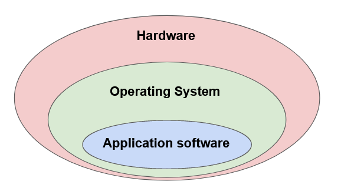
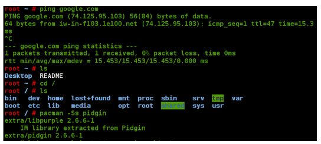
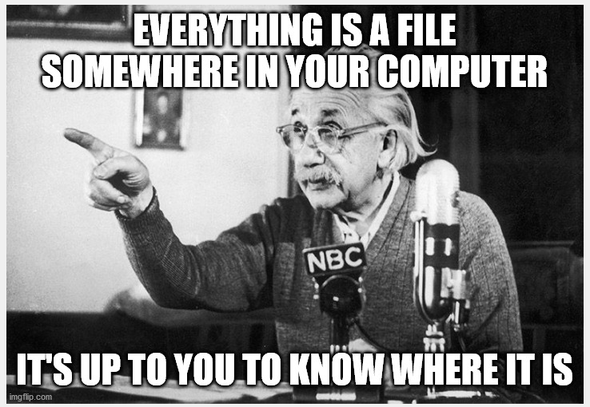
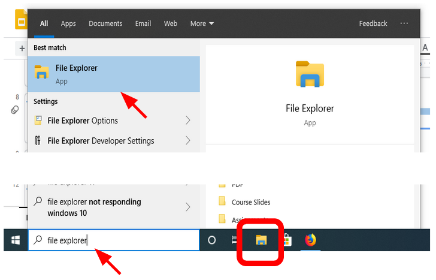
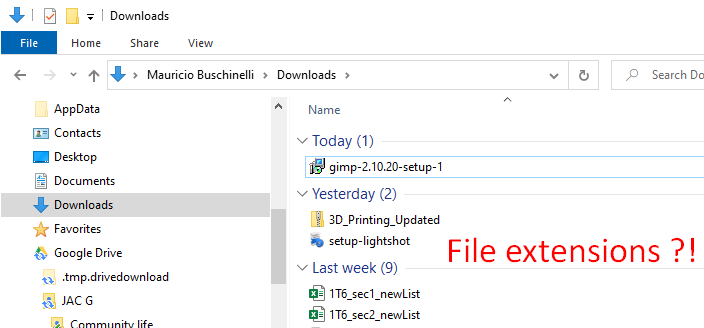

# Intro to Operating Systems

In this section we will take a look at how the operating system software interacts and controls the hardware.

Previously we had defined **software** as: *any **set of instructions** that tells the hardware **what to do** and **how to do it**.*

Let's focus on two types of software: **the operating system and application software**

 

**Operating System / System Software**

>  An operating system is a set of programs that:
>
> - Run inside the hardware,
> - manage the hardware resources,
> - host application software, and
> - provide a user interface

 

[

<a href="https://www.addictivetips.com/mobile/an-introduction-to-modern-mobile-operating-systems/"><em>Examples of Mobile Operating Systems</em></a>

 

**Application Software**

> Programs that run and execute instructions inside the operating system.

 

<a href="#"><em>Hosting relationship between Hardware and Software</em></a>

 

## Operating System Software

The operating system is mainly composed of different different types of software:

- The Shell, and
- The Kernel

### The Shell

The Shell is the outer layer of the operating system (OS).

It provides the user an interface in order to interact with the Kernel

 

<a href="https://aquaticarts.com/"><em>The OS Shell is what users see and interact with</em></a>

 

There are two categories of OS Shells:

#### Command Line Interfaces (CLI)

Provide a text-based interface to type and read commands

 

#### Graphical User Interfaces (GUI)

Provide graphical representations of files, folders, windows, icons, etc.

 

### The Kernel

The Kernel is the core component of the OS.

It manages and controls all system resources and makes them available to other software, including the Shell. 

It is the Kernel that manages requests to and from Input and Output devices (mouse, microphone, monitor, etc).

 

<a href="https://aquaticarts.com/"><em>The Kernel controls the OS</em></a>

 

Below is a simplified diagram of the operating system indicating the relationship between main software and hardware components:

 

<a href="#"><em>System components. Arrows show the direction of information exchange. OS is highlighted in yellow</em></a>

 

The Task Manger program is a graphical representation of the main resources managed by the Kernel:

- RAM and CPU allocation and usage
- Processes, services and programs running
- Access to the Storage Disc
- Access to the network card
- Etc.

 

 

## The Computer File System

Every single program, image, video, document, etc, exists in your computers as file located somewhere in the File System.

 

 

The computer file system is organized as a trees, where the origin of each tree is the **root directory**

In Windows, the root directories are assigned a letter and usually represent a Storage Drive.

 

<a href="#"><em>Windows file system with four root directories (A:, C:, D:, F:)</em></a>

 

Files systems normally contain:

- **Data** (the files)
- **Directories** (folders)
- **Metadata** (information about the data)
  - File size
  - File-type
  - Time modified

 

### File Types

Each file can hold information in a multitude of different formats.

For example, an image file stores image information in a completely different way than a text file.

> To quickly distinguish between the different types files, we use a file extension at the end of each file type

 

Here are some examples of file types and their extensions:

| **Images** | **Documents** | **Audio** | **Video** | Compressed files |
| ---------- | ------------- | --------- | --------- | ---------------- |
| .png       | .docx         | .mp3      | .mp4      | .rar             |
| .jpeg      | .txt          | .wav      | .avi      | .zip             |
| .gif       | .html         | .flac     | .webm     | .7z              |

 

### File Manager Software

> A File Manager is an application software that helps us navigate, find, organize and manage files and folders in file system.

Windows' default file manager is the **File Explorer** program.

 

### Showing file extensions

By default File Explorer hides the file extensions. 

 

Microsoft choose to do this to simplify the user interface and not overwhelm new users.

**If you would like to see the file extensions directly on File Explorer you have to enable it**

Enabling file extensions is not necessary but it will allow you to better understand what kinds of files you are dealing with "under the hood".

 

 

To enable the file extensions in File Explorer select the *View Menu* and click on the *File name extensions* check box.

 

