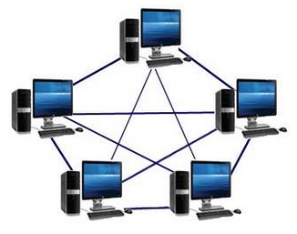
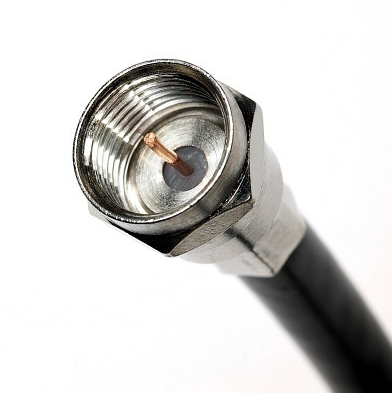
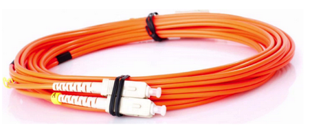
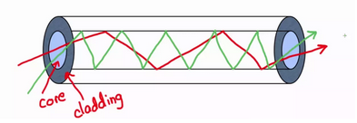
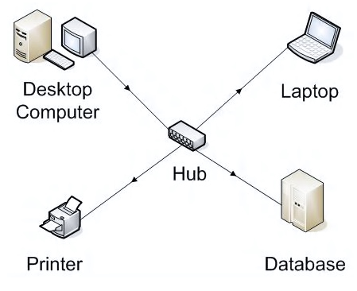
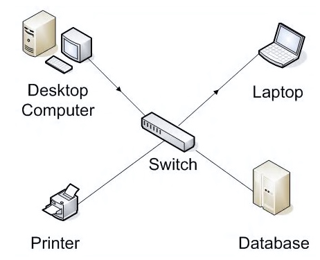
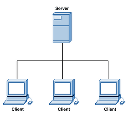

This lesson was based on the page [How does the Internet work?](https://developer.mozilla.org/en-US/docs/Learn/Common_questions/How_does_the_Internet_work) by MDN web docs

 

# How the Internet Works

The **Internet** is the backbone of the Web, the technical  infrastructure that makes the Web possible.

> At its most basic, the  Internet is a large **network of networks** of computers which communicate all together.

The simplest form of a network are two computers connected together with a single cable. 

This model is simple but it already involves concepts that also apply to the network of a building or the internet itself. There concepts include:

- What is the physical arrangement of the wire for this to work?
- How does the signal information makes it's way to a running program such as the browser?

 

 

Internet involves billions of computers so we know this model needs to be expanded.

We need a way for a group of connected computers (a smaller and local network) to communicate to another group of connected computers.

 

 

This arrangement is very similar to what is typically found in buildings such as John Abbott's Penfield, and lays some fundamentals to understanding how the internet works.

After all, the internet is a network of networks:

 

<a href="https://www.businessinsider.com/animated-map-global-fiber-optic-internet-cables-2015-9"><em>Internet fiber optic cables connecting Europe to Africa, North America and Middle East</em></a>

 

## Networking

A computer network is a series of computers and other devices interconnected by communication paths.

Computer networks can be categorized according to their "scale" and include:

**LAN(s): Local Area Network(s);**

- Ex. A network that connects:
  - The computers in a house,
  - The computers of a building such as JAC's Penfield building,
  - The computers inside a computer lab.

**WAN(s): Wide Area Networks(s).**

- Ex. A network that connects:
  - The city of Montreal to the city of Ottawa,
  - North America to Europe

 

<a href="https://www.networkstraining.com/lan-vs-wan-networks-comparison/"><em>LAN vs WAN: a difference in scale.</em></a>

 

## Nodes & Networking Devices

Devices connected and communicating in a network are know as **Nodes**. Some examples are:

- Workstations and laptops,
- Printers,
- Servers,
- Smartphones and tablets.

 

Devices that are part of the network but have the job to facilitate the communication are know as **Networking Devices**. Some examples are:

- Switches
- Routers
- Modems
- Firewalls

 

##  Network Topology

The network topology defines the configuration in which computers, and other devices are connected.

It describes the layout of the wires and devices as well as the paths used by data transmissions.

 

<a href="https://simple.wikipedia.org/wiki/Network_topology"><em>Diagram of different network topologies.</em></a>

 

### Bus Topology

In a bus topology all the devices are connected by one single cable known as the **back-bone cable**.

This is similar to a phone line of a house with multiple phones connected to it.

In this configuration we have the following types of connection:

- Nodes: connected devices.

- T-connector: allows a node to be connected.

   

 

**Advantages**

- Easy to connect a computer to a bus line.
- Requires less cable than most other topologies.

**Disadvantages**

- Every node is listening to all the data all the time.
- The entire network fails if the back-bone is broken.
- Difficult to identify where the problem is if the network fails.

 

### Star & Tree Topology

In a **start  topology** each node is connected directly to a central networking device or a central hub. The hub acts as a moderator to receive and transmit messages.

 

 

Larger networks use the extended star topology also called **tree topology**.

 

 

**Advantages**

- A single node or connection failure will not affect the entire network.

- Nodes can be added or removed without disturbing the network. 

- Significantly reduces the traffic by sending data only to the wires of the destination host.

**Disadvantages**

- Expensive network layout: each node requires a dedicated cable the central hub.

- The central hub is a single point of failure for the network

 

### Mesh Topology

In a mesh topology most nodes are connected to many other nodes for redundancy and fault tolerance.

It is used in WANs (wide area networks) to interconnect LANs (local area networks) and **when reliability and decentralization are important.**

 

 

**Advantages**

- No traffic problems as there are dedicated point to point links for each node.

- Multiple links, if one route is blocked then other can be used.

- Provides high privacy and security.

- Fault identification is easy because of point-to-point connection.

**Disadvantages**

- Requires more cables and I/o ports to connect nodes

- Implementation is more difficult since each node needs to manage a connection to every node.

- Mesh topology is costly compared to the other topologies.

 

## Network Components

Now we will take a look at the different elements that make networking communication possible:

- Physical Media (what carries the information)
- Networking Devices (interconnecting devices)
- Nodes (computers, tables, smartphones)
- Communication Protocols (the "language spoken" by these devices)
- Applications

### Physical Media

Physical media is the vessel that carries the signals (binary data) which are sent from one computer to another.

The physical media can take two forms: **Cable or Wireless**.

#### Coaxial Cable

Uses a copper conductor at its center. A plastic layer provides insulation between the center conductor and a braided metal shield.

 

Coaxial cables are commonly used for connecting television sets to home antennas.

 

#### Twisted Pair Cables

Twisted pair cables are the most common physical media in modern LANs. It is also used for regular phone lines inside a house.

The twist in the wire protect the inner conductor. There are shielded and unshielded options.

The transfer speeds of a twisted pair depends on it's cable category.

- Category 5e and 6 are the most popular
- Can reach transfer rates of over 1000 Mbps (mega bits per second).

| Category | Transfer Rate |
| :------: | :-----------: |
|    3     |    10 Mbps    |
|    5     |   100 Mbps    |
|    5e    |    1 Gbps     |
|    6     |   1/10 Gbps   |

 

 

#### Fiber Optic Cables

Fiber optic cables uses a glass core to carry light pulses. This means that the **information moves at the speed of light.**

 

 

Both the coaxial cable and the twisted pair cable use copper to transmit electricity. For traveling long distances electricity is not as efficient and copper wires loose the signal quickly. Fiber optics in the other hand has extremely low signal loss and is much faster than electricity.

Light is trapped in the glass core of the cable due to refraction and travels by bouncing inside the core.

 

### Wireless Media

All wireless uses electromagnetic waves to transmit data. The transmission depends mostly on the intensity of the signal and on it's frequency.

 

 

Wifi routers operate around the 2.4 GHz and 5 GHz frequencies. GPS satellite signals are transmitted around 1 to 10 MHz.

In this course we will not get into the details how it works.

 

## Networking Devices

Network devices connect nodes to a network and they connect different networks together.

Examples of networking devices are:

- Hub

- Switch
- Router
- Wireless Access Point
- Modem

> It is the networking device that defines the physical media and speed of a network.

We will take a brief look at each networking device.

 

### Bandwidth: the network speed

The bandwidth of a network is the speed at which it can exchange information.

This data rate (the rate of data exchange) is **measured in bits per second.** The most common units are:

- Kbps (Kilobits per seconds)
- Mbps (Megabits per seconds)
- Gbps (Gigabits per seconds)

 

### Hub

A networking hub transmits (repeats) a received packet from one of its ports to all other connected devices.

<a href="http://cloudcomputingnet.com/computer-network-components/"><em>Hubs are an obsolete networking devices</em></a>

 

When a computer request information from a particular  computer, it transmits the request to the hub, who in turn broadcasts it to the entire network. Each  device in the network would then work out if the broadcast data is for  them or just drop it if it is not.

 

 

<a href=""><em>Hubs work like a radio broadcaster and all nodes must listen to all the messages.</em></a>

 

This consumes more bandwidth on the network and limits the amount of communication.

**Currently Hubs are almost obsolete.**

 

### Switch

Network switches work similarly to the Hub but are more intelligent. When a message is received the switch **transmits it only to the specific destination node**.

The switch uses the node's MAC address (a sort of “machine burned-in ID”) to keep a list of all connected devices.

<a href="http://cloudcomputingnet.com/computer-network-components/"><em>Switches transmit messages from one device to another</em></a>

 

Switches behave similarly to an old-school telephone operator. Someone would call in and ask to be connected to a specific phone number. Then the operator would make the connection happen.

 

<a href=""><em>Switches and Routers work like an old-school telephone operator</em></a>

 

### Routers

Network routers are used to connect different networks together. These networks might be in the same building (LAN) or across the internet.

Routers are conscious of neighboring networks and dynamically update their routing information. They can discover when a route to a network is down and find out if another route is accessible.

 

 

<a href="https://www.cisco.com/en/US/docs/internetworking/troubleshooting/guide/tr1909.html"><em>Sample routing table for connected routers.</em></a>

 

Routers use IP addresses to manage their routing, which are easily modifiable addresses.

You can think of a router like a switch that can see beyond the nodes that are immediately connected to it. Instead of looking at the node's physical address (MAC), it looks are the logically assigned addresses (IP).

 

### Modem

The signals transmitted from one computer to another inside a LAN are typically transmitted over wifi or twisted pair cable (also know as ethernet cable or cat5).

However, to travel long distances, these signals need to be converted to the format of the physical media that will transport them, such as optical fiber, coaxial cable, phone line or satellite signals.

 

 

This is similar to the signal received for cable TV. The TV signal typically comes via coaxial cable, gets converted and is sent to the TV via HDMI cable.

> In order to convert the signals from one format to another we use a modem.
>
> Modem stands for **Mo**dulator / **Dem**odulator

This is an encoding and decoding process between two systems. The logic resembles the conversions that happen to go from text to binary in the ASCII encoding system.

**The type of modem required depends on the physical media being used to transmit the signal over long distances.**

 

The physical media that connects a LAN to the internet depends on the connection services being purchased by the user.

We'll take a quick look at the following connection services:

- Dial-Up
- DSL
- Cable
- Satellite
- Fiber

 

## Connection Services

In order to connect to the internet, a network needs to purchase a connection service from a **Internet Service Provider (ISP)**.

The ISP typically sells a connection service that ranges in price depending on the availability of the physical media at your location and the speed of the connection.

As we look at the different types of connections it might be interesting to look at the offers from a few different ISPs:

- [Bell Internet](https://www.bell.ca/Bell_Internet/Internet_access)

- [E-box](https://www.ebox.ca/en/quebec/residential/internet-packages/)

- [Distributel](https://www.distributel.ca/shop/internet-quebec/)

- [Xplornet](https://www.xplornet.com/internet-packages/)

  

### Dial-Up Connection

The dial-up connection happens over the telephone line.

Speeds are usually around 56 Kbps.

[This is the infamous dial-up connection sound.](https://www.dialupsound.com/) More about why it sounds like that [here.](https://www.popularmechanics.com/science/a29611456/internet-dialup-modem-sounds/)

 

### xDSL (Digital Subscriber Line)

Data transmission over unused frequencies on traditional telephone lines.

Speeds range from:

- Downloads: 128Kbps - 4Mbps
- Uploads: 64Kbps - 800Kbps

For this you will need a DSL modem and splitters are required to separate the voice and data signal.

 

### Cable Internet

A technology that provides digital data transmission over **coaxial cable for TV infrastructure**. Requires a cable modem.

Speed

- Downloads: Up to 1Gbps.
- Uplink: 50Mbps

 

### Satellite

Data transmission over satellites. Requires a satellite dish.

Speeds 

- Download: 500Kbps - 10Mbps
- Uploads: 50Kbps - 1Mbps

 

### Fiber

Some ISPs offer fiber to the home, others offer fiber to the neighborhood and then make the final connection over cable or telephone lines.

Requires a fiber modem.

Speeds:

- Downloads: 500Mbps - 2.4Gbps
- Uploads:  150Mbps - 1Gbps

 

## Server Nodes

Network nodes usually have a client - server relationship. 

A server is a **dedicated computer** whose only function is to respond to the requests of clients (also known as hosts).

The server contains the files, folders, application, security, and other services in a central location.

> What makes a computer a server or not is mostly depending on the software running in that computer.

For example, when you ask for a page to be loaded in your web browser, your browser is a client and sends a request to a server on the internet.

The server responds to your request by returning a webpage and all the information required to display it (images, text, formatting, etc.)

 

 

## NIC

The final piece of hardware that is required to allow a computer to be part of the network is the **network interface controller (NIC) also known as the network adapter**.

> This is the physical device that literally connects the computer to the physical media.

In the case of the LAN it would connect the computer to a twisted pair cable (Ethernet cable) or Wifi signal.

<a href=""><em>Ethernet NIC with PCIe attachment</em></a>

 

<a href=""><em>Wireless NIC module typically found in laptops</em></a>

 

The **MAC address or physical address** is controlled by the NIC. This is typically an address assigned by the manufacturer of the NIC.

MAC stands for **Media Access Code** and has the following format (in hexadecimal values): **DC-4A-3E-4A-3B-3D**

 

A NIC is required for Ethernet or Wireless connections. For wireless its also called WNIC (W for wireless).

Nowadays it's typically part of the motherboard.

 

## Recommended Video

 

<iframe width="560" height="315" src="https://www.youtube.com/embed/ZhEf7e4kopM" frameborder="0" allow="accelerometer; autoplay; clipboard-write; encrypted-media; gyroscope; picture-in-picture" allowfullscreen></iframe>

